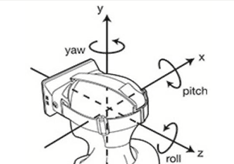

# ArcFace.Net
虹软人脸识别.NET工具库(.Net Standard 2.1)。基于ArcFace 3.x C++ SDK, 支持Windows x86/x64和Linux x64. 支持人脸库属性检测、人脸特征提取、人脸库维护、人脸搜索、活体检测等功能。

## Nuget
[https://www.nuget.org/packages/ArcFace.Net/](https://www.nuget.org/packages/ArcFace.Net/)

## 平台支持
1. Windows x86/x64
2. Linux x64

    * 该程序基于ArcFace 3.x C++ SDK开发，`DllImport`引入C++动态库时依赖于Linux系统库(`libdl.so.2`)，因此并低配Linux环境(如Alpine等)可能存在兼容性问题。
    经测试一下系统可以正常运行。
        * `Debian 10 +`
        * `Ubuntu20.04 +`
        * `CentOS 8 +`
    * Linux环境中图像处理依赖`libgdiplus`包，需要手动安装到系统中。
        ```bash
        # Debian 10
        apt install libgdiplus/stable
        
        # Ubuntu 20.04
        apt install libgdiplus/focal
        ```
## SDK
从 [虹软开发者中心](https://ai.arcsoft.com.cn/ucenter/resource/build/index.html#/application)或[此处](https://github.com/colin-chang/ArcFace.Net/tree/main/ColinChang.ArcFace/Sdks)下载需要的SDK 3.x文件并放置同特定目录。
* Windows 需要将SDK dll文件拷贝到执行程序所在目录，或环境变量配置的目录
* **Linux 需要将SDK so文件拷贝到`/lib`等系统程序目录，或环境变量配置的目录**

从 [虹软开发者中心](https://ai.arcsoft.com.cn/ucenter/resource/build/index.html#/application) 获取授权信息(AppId/SdkKey)，通过`ArcFaceOptions`传入配置。具体用法参见 [示例程序](https://github.com/colin-chang/ArcFace.Net/tree/main/ColinChang.ArcFace.Sample)。

## 资源回收
* 工具中自动维护引擎池进行资源回收利用，无需手动管理。
* 工具支持多并发操作。
* 推荐使用**单例方式**使用。
* `ArcFace`实现`IDisposable`，使用完毕后需要`Dispose()`以销毁引擎回收其它相关内存。

## 图像质量要求
* 图片尺寸大于2K且小于10MB
* 图片格式支持 ".jpg",".png",".bmp"
* 图片中人脸尺寸不小于50 x 50像素
* 建议待检测的图像人脸角度上、下、左、右转向小于30度

## 人脸3D角度 
俯仰角（pitch）， 横滚角（roll）， 偏航角（yaw）



## 错误码

| 错误码名                                   | 十六进制 | 十进制 | 描述                                                     |
| :----------------------------------------- | :------- | :----- | :------------------------------------------------------- |
| MOK                                        | 0x0      | 0      | 成功                                                     |
| MERR_UNKNOWN                               | 0x1      | 1      | 错误原因不明                                             |
| MERR_INVALID_PARAM                         | 0x2      | 2      | 无效的参数                                               |
| MERR_UNSUPPORTED                           | 0x3      | 3      | 引擎不支持                                               |
| MERR_NO_MEMORY                             | 0x4      | 4      | 内存不足                                                 |
| MERR_BAD_STATE                             | 0x5      | 5      | 状态错误                                                 |
| MERR_USER_CANCEL                           | 0x6      | 6      | 用户取消相关操作                                         |
| MERR_EXPIRED                               | 0x7      | 7      | 操作时间过期                                             |
| MERR_USER_PAUSE                            | 0x8      | 8      | 用户暂停操作                                             |
| MERR_BUFFER_OVERFLOW                       | 0x9      | 9      | 缓冲上溢                                                 |
| MERR_BUFFER_UNDERFLOW                      | 0xA      | 10     | 缓冲下溢                                                 |
| MERR_NO_DISKSPACE                          | 0xB      | 11     | 存贮空间不足                                             |
| MERR_COMPONENT_NOT_EXIST                   | 0xC      | 12     | 组件不存在                                               |
| MERR_GLOBAL_DATA_NOT_EXIST                 | 0xD      | 13     | 全局数据不存在                                           |
| MERR_FSDK_INVALID_APP_ID                   | 0x7001   | 28673  | 无效的 AppId                                             |
| MERR_FSDK_INVALID_SDK_ID                   | 0x7002   | 28674  | 无效的 SDKkey                                            |
| MERR_FSDK_INVALID_ID_PAIR                  | 0x7003   | 28675  | AppId 和 SDKKey 不匹配                                   |
| MERR_FSDK_MISMATCH_ID_AND_SDK              | 0x7004   | 28676  | SDKKey 和使用的 SDK 不匹配,请检查入参                    |
| MERR_FSDK_SYSTEM_VERSION_UNSUPPORTED       | 0x7005   | 28677  | 系统版本不被当前 SDK 所支持                              |
| MERR_FSDK_LICENCE_EXPIRED                  | 0x7006   | 28678  | SDK 有效期过期，需要重新下载更新                         |
| MERR_FSDK_FR_INVALID_MEMORY_INFO           | 0x12001  | 73729  | 无效的输入内存                                           |
| MERR_FSDK_FR_INVALID_IMAGE_INFO            | 0x12002  | 73730  | 无效的输入图像参数                                       |
| MERR_FSDK_FR_INVALID_FACE_INFO             | 0x12003  | 73731  | 无效的脸部信息                                           |
| MERR_FSDK_FR_NO_GPU_AVAILABLE              | 0x12004  | 73732  | 当前设备无 GPU 可用                                      |
| MERR_FSDK_FR_MISMATCHED_FEATURE_LEVEL      | 0x12005  | 73733  | 待比较的两个人脸特征的版本不一致                         |
| MERR_FSDK_FACEFEATURE_UNKNOWN              | 0x14001  | 81921  | 人脸特征检测错误未知                                     |
| MERR_FSDK_FACEFEATURE_MEMORY               | 0x14002  | 81922  | 人脸特征检测内存错误                                     |
| MERR_FSDK_FACEFEATURE_INVALID_FORMAT       | 0x14003  | 81923  | 人脸特征检测格式错误                                     |
| MERR_FSDK_FACEFEATURE_INVALID_PARAM        | 0x14004  | 81924  | 人脸特征检测参数错误                                     |
| MERR_FSDK_FACEFEATURE_LOW_CONFIDENCE_LEVEL | 0x14005  | 81925  | 人脸特征检测结果置信度低                                 |
| MERR_ASF_EX_FEATURE_UNSUPPORTED_ON_INIT    | 0x15001  | 86017  | Engine 不支持的检测属性                                  |
| MERR_ASF_EX_FEATURE_UNINITED               | 0x15002  | 86018  | 需要检测的属性未初始化                                   |
| MERR_ASF_EX_FEATURE_UNPROCESSED            | 0x15003  | 86019  | 待获取的属性未在 process 中处理过                        |
| MERR_ASF_EX_FEATURE_UNSUPPORTED_ON_PROCESS | 0x15004  | 86020  | PROCESS 不支持的检测属性，例如 FR，有自己独立的 处理函数 |
| MERR_ASF_EX_INVALID_IMAGE_INFO             | 0x15005  | 86021  | 无效的输入图像                                           |
| MERR_ASF_EX_INVALID_FACE_INFO              | 0x15006  | 86022  | 无效的脸部信息                                           |
| MERR_ASF_ACTIVATION_FAIL                   | 0x16001  | 90113  | SDK 激活失败，请打开读写权限                             |
| MERR_ASF_ALREADY_ACTIVATED                 | 0x16002  | 90114  | SDK 已激活                                               |
| MERR_ASF_NOT_ACTIVATED                     | 0x16003  | 90115  | SDK 未激活                                               |
| MERR_ASF_SCALE_NOT_SUPPORT                 | 0x16004  | 90116  | detectFaceScaleVal 不支持                                |
| MERR_ASF_ACTIVEFILE_SDKTYPE_MISMATCH       | 0x16005  | 90117  | 激活文件与 SDK 类型不匹配，请确认使用的 sdk              |
| MERR_ASF_DEVICE_MISMATCH                   | 0x16006  | 90118  | 设备不匹配                                               |
| MERR_ASF_UNIQUE_IDENTIFIER_ILLEGAL         | 0x16007  | 90119  | 唯一标识不合法                                           |


## 问题
* 人脸检测和特性提取目前进识别到的人脸角度不准确，目前识别到的角度均为0度。
* 视频模式人脸追踪未开发
* 活体检测未开发

## 参考文档
https://github.com/colin-chang/ArcFace.Net/blob/main/sdk_3.0.pdf
